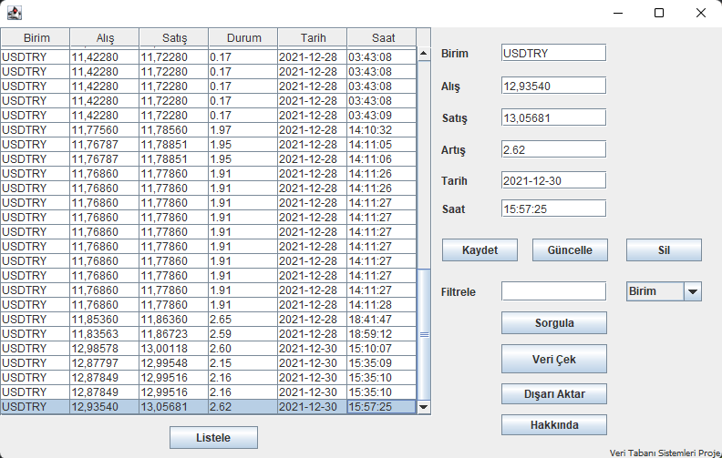
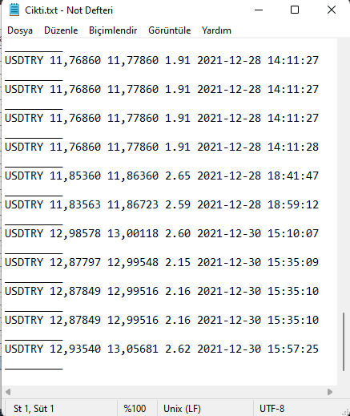

# **Veri Tabanı Sistemleri Proje**
## Java Database kullanarak Borsa Uygulaması 

Proje Konusu:
Java ile istediğimiz siteden veri çekerek bunu veri tabanına kaydedebiliyoruz. Veri tabanına kaydettiğimiz verileri arayüz arayıcılığı ile görüntüleyebiliyoruz ve `INSERT INTO`
`UPDATE` ve `DELETE` gibi sorgulamaları gerçekleştirebiliyoruz. Son olarak bu çektiğimiz verileri istersek .txt olarak çıktı alabiliyoruz.

**Açıklamalar:**

Projemizin çalışması için gerekli olan `MySQL JDBC connector` ve `jsoup` java kütüphanemize eklememiz gerekmetedir. library kısmında `mysql-connector-java-5.1.18-bin.jar` ve `jsoup-1.14.3.jar` adı altıdna bulunmaktadır.

## v1.2

- Bir borsa sitesinden paranın Birimi, alışı, satışı, artışı, o an ki saatini ve tarihini çekebiliyoruz.
- Verileri .txt olarak çıktı alabiliyoruz.
- Hakkkında kısmı eklendi.


## v1.1

- Jsoup ile siteden veri çekme eklendi.

- Gelecek güncellemede siteden çekilen veri arayüze de aktarılacak.


## v1.0

- Arayüz eklendi.
- Arayüz üzerinden `SELECT`,`UPDATE`,`INSERT` ve `DELETE` gibi komutları yapabiliyoruz.

- Gelecek güncellemede siteden veri çekme eklenecek.

## Bilgilendirme


**Veri çekeceğimiz siteye bağlanmak için:**

```java
Document doc = Jsoup.connect("site").get();
```

**Veri çekilecek sitedeki birimlerin konumunu belirtmek için**

```java
Element baslikElementi = doc.select("konum").first();
```
> Örnek kullanım: Bu şekilde div içindeki -x0'ın a kısmından Para biriminin ne olduğunu çekiyoruz.

```java
Element baslikElementi = doc.select("div.-x0 > a").first();
```

**Database bağlantısı için:**

Bağlantı için yazış şekili:
```java
jdbc:mysql://ipadresi:port/db_adı
```
Database kullanıcı adı:
```java
String username = "KullanıcıAdı";
```
Database Parola:
```java
String password = "Parola";
```

Projemizin çalıştığında aldığımız çıktı:


> Projemizin son hali


> Çekilen verilerden alınan .txt çıktısı


