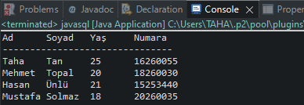

# Veri Tabanı Sistemleri Proje
## Java ile SQL Sorgulama

Proje Konusu:
Java ile sitelerden veri çekip (Selenium kullanmayı planlıyoruz). Bu verileri ise database'e kaydedip yine java ile istediğimiz sorgulamaları yapıp, yapılan sorgulamaları da .txt ya da excel dosyası olarak çıktılarını almak. Şuan için sadece database üzerinden sorgulamarı yapıp çıktı alınıyor. İlerleyen aşamalarda sitelerden veri çekmeyi de ekleyeceğiz.

Açıklamalar:

Projemizin çalışması için gerekli olan `MySQL JDBC connector` java kütüphanemize eklememiz gerekmetedir. src kısmında `mysql-connector-java-5.1.18-bin.jar` adı altıdna bulunmaktadır.

Gerekli importlar:
```java
import  java.sql.Connection;		
import  java.sql.Statement;		
import  java.sql.ResultSet;		
import  java.sql.DriverManager;		
import  java.sql.SQLException;
```

Database bağlantısı için:

Bağlantı için yazış şekili:
```java
jdbc:mysql://ipadresi:port/db_adı
```
Database kullanıcı adı:
```java
String username = "KullanıcıAdı";
```
Database Parola:
```java
String password = "Parola";
```
Çalıştırılacak sorgular için:
```java
String query = "select *  from tabloadı;";
```
> Bu kısımda istediğimiz tüm sorgulamaları yapabiliriz.

Projemizin çalıştığında aldığımız çıktı:


> Şuan için böyle ilerde geliştirilecek.


